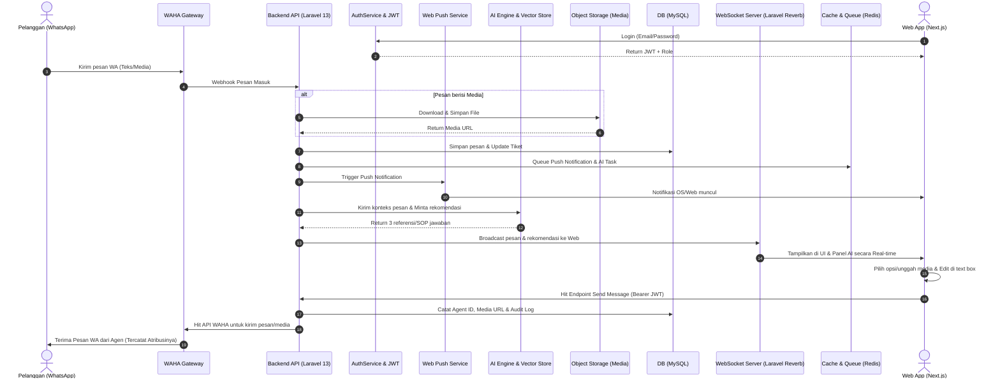

# PRD — Project Requirements Document

## 1. Overview
Tim IT Helpdesk seringkali membuang banyak waktu untuk mengetik ulang jawaban yang sama berulang kali dalam melayani pertanyaan atau keluhan pelanggan. Hal ini menyebabkan waktu respon (SLA) menjadi lambat dan beban kerja agen meningkat. 

**Mini Helpdesk AI Assist** adalah aplikasi *omnichannel* internal berbasis antarmuka web (mirip dengan WhatsApp Web) yang didesain untuk menyelesaikan masalah tersebut. Aplikasi ini menggunakan WhatsApp (via WAHA) sebagai jalur komunikasi utama dengan pelanggan, namun dibekali dengan **AI Co-Pilot** di sisi agen. AI akan membaca pesan masuk, menganalisis riwayat *chat*, membaca *Knowledge Base* (SOP), dan memberikan 3 rekomendasi jawaban. Agen cukup melakukan satu klik untuk memilih, mengedit sedikit jika perlu, lalu mengirimkannya. Sistem ini menjamin tidak ada balasan otomatis (100% *Human-in-the-loop*) guna mencegah halusinasi AI dan menjaga kualitas layanan. Selain itu, sistem kini dilengkapi dengan notifikasi *push* real-time, dukungan multimedia lengkap, pelacakan atribusi agen yang ketat, serta autentikasi aman berbasis peran.

## 2. Requirements
- **Human-in-the-Loop (No Auto-Reply):** AI diwajibkan hanya bertindak sebagai asisten pembuat draf (memberikan 3 rekomendasi jawaban). Agen manusia tetap memegang kendali penuh untuk klik (pilih), *edit*, dan *approve* sebelum pesan dikirim.
- **RAG (Retrieval-Augmented Generation) Berbasis SOP:** AI dilarang keras berhalusinasi atau memberikan janji palsu. AI harus mengacu secara ketat pada dokumen SOP / *Knowledge Base* internal perusahaan saat membuat draf jawaban.
- **Web Push Notifications:** Sistem wajib menyertakan notifikasi *push* berbasis web yang mampu memperingatkan agen mengenai pesan masuk, bahkan ketika tab aplikasi tidak aktif, di-minimize, atau browser berjalan di latar belakang.
- **Multimedia Support:** Mendukung pengiriman dan penerimaan berbagai format media secara native (gambar, audio/voice note, dokumen PDF/DOCX, video) tanpa kehilangan kualitas atau metadata.
- **Sistem Real-time yang Scalable:** Aplikasi harus dapat menangani pesan masuk dan keluar secara *real-time* tanpa perlu di-*refresh*, layaknya menggunakan aplikasi WhatsApp asli. Arsitektur backend dan frontend harus dirancang untuk Skalabilitas tinggi.
- **Keamanan & Clean Architecture:** Menggunakan arsitektur kelas *enterprise* dengan desain API *stateless*. Tidak boleh ada *hardcode credential* pada *source code*. Semua *environment variables* (API Key WaHA, LLM, JWT Secret, DB, Push Keys) harus diamankan. Autentikasi wajib dilakukan via mekanisme login terenkripsi dengan sesi berlapis.
- **Ticketing & SLA Terstruktur:** Setiap interaksi dengan pelanggan harus dijadikan tiket dengan status siklus hidup yang jelas (Open, Pending, On Progress, Closed) dan dipantau waktu penyelesaiannya.
- **Agent Attribution & Audit Trail:** Setiap balasan atau aksi di sistem harus teratribusi secara eksplisit kepada agen tertentu. Jejak digital lengkap disimpan untuk kepatuhan dan akuntabilitas internal.

## 3. Core Features
- **Real-time Chat Inbox (WhatsApp UI Cloned):** Tampilan web persis seperti WhatsApp Desktop untuk kemudahan adaptasi. Dilengkapi penanda sedang mengetik (*typing indicator*), status *online/offline* agen, dan fitur pencarian percakapan. Mendukung preview media inline (gambar, dokumen, voice).
- **Web Push Notifications:** Layanan notifikasi *push* yang terintegrasi dengan Service Worker browser. Otomatis memunculkan notifikasi OS (desktop/mobile) dengan konten ringkas (nama pelanggan & cuplikan pesan) saat ada chat masuk, memastikan agen tidak tertinggal meskipun sedang di aplikasi lain.
- **Multimedia Support:** Fitur kirim/terima file multimedia secara native. Sistem akan mengunduh media dari WAHA, menyimpannya secara aman di *object storage*, dan menyajikan URL terenkripsi ke frontend. Agen dapat melampirkan gambar, audio, atau dokumen ke dalam balasan atau catatan internal.
- **AI Suggestion Panel (One-Click Reply):** Panel pintar di sebelah jendela obrolan. Setiap ada pesan baru, panel ini memunculkan 3 opsi balasan berdasarkan SOP. Agen bisa menekan satu tombol untuk memindahkan draf ke kotak teks.
- **Secure Authentication System:** Halaman login terautentikasi untuk agen dan admin. Menggunakan mekanisme sesi berbasis token dengan *Role-Based Access Control* (RBAC) ketat (Admin: akses penuh & manajemen, Agent: akses tiket & chat). Fitur logout manual, *session timeout*, dan proteksi rute backend.
- **Agent Attribution/Tracking:** Setiap bubble chat menampilkan *badge* atau label metadata yang mencatat secara eksplisit nama agen yang mengirim pesan, beserta timestamp. Sistem secara otomatis mencatat `Agent ID` pada setiap payload balasan untuk pelacakan akurasi dan evaluasi performa.
- **Helpdesk Ticketing System:** Manajemen tiket otomatis dari setiap pelanggan. Status tiket dapat diganti, dapat di-*assign* (ditugaskan) antar agen, serta dilengkapi *SLA monitoring* (peringatan jika tiket terlalu lama dibiarkan terbuka).
- **Internal Collaboration:** Fitur *Internal Notes* (pesan rahasia antar agen di dalam tiket yang tidak terlihat oleh pelanggan) dan sistem *Escalation* (pengalihan tiket ke atasan atau ahli lain).
- **Knowledge Base Management:** Modul bagi Admin untuk mengunggah dan memperbarui SOP / dokumen perusahaan yang akan dibaca oleh AI.
- **Admin & Security Panel:** Mencakup manajemen kontak pelanggan (*Contact Management*), akses agen dengan RBAC, manajemen kunci API, dan fitur rekaman jejak digital (*Audit Log*).

## 4. User Flow
1. **Autentikasi & Login:** Agen membuka Web App -> Masuk ke halaman Login -> Memasukkan kredensial -> Backend memvalidasi & mengembalikan JWT -> Agen diarahkan ke Dashboard Chat.
2. **Pesan Masuk & Push Trigger:** Pelanggan mengirim pesan WhatsApp (Teks/Media) -> WAHA menangkapnya -> Backend menyimpan pesan ke DB -> Backend memicu *Push Notification Service* -> Web App & OS Agen menampilkan notifikasi *push* secara instan.
3. **AI Bekerja:** Di belakang layar, AI menganalisis pesan pelanggan, melihat riwayat obrolan, mencocokkan dengan SOP (via Vector DB), lalu menghasilkan 3 draf jawaban. Backend menyimpan media (jika ada) dan men-*broadcast* update via WebSocket.
4. **Agen Merespon:** Agen IT Helpdesk melihat antrean di Web App. Ia membuka obrolan, mengklik salah satu *AI Suggestion* (atau mengunggah file multimedia sendiri jika diperlukan).
5. **Atribusi & Kirim:** Teks/media rekomendasi masuk ke kotak input. Sistem secara otomatis menempelkan metadata agen yang sedang aktif. Agen memvalidasi/mengedit -> Tekan *Send*.
6. **Pesan Keluar & Penutupan:** Pesan diteruskan dari Web App -> Backend -> WAHA -> Masuk ke WhatsApp Pelanggan. Backend mencatat `agent_id`, `media_url`, dan timestamp ke Audit Log. Apabila masalah selesai, agen mengubah status tiket menjadi *Closed*.

## 5. Architecture
Sistem menggunakan pola arsitektur *Decoupled Client-Server* untuk memastikan skalabilitas independen antara antarmuka pengguna dan logika bisnis. Komunikasinya menggunakan REST API (stateless) serta WebSocket (via Laravel Reverb) untuk transmisi data *real-time*. Autentikasi dan pengelolaan media ditambahkan sebagai layer keamanan dan ketahanan data. 

Backend menggunakan **Laravel 13** yang dirancang sebagai *Stateless Core API*, menangani routing, business logic, database interaction, queue processing, dan WebSocket broadcasting. Frontend menggunakan **Next.js** sebagai *headless client* yang mengkonsumsi API secara efisien. Database relasional menggunakan **MySQL** untuk integritas data, sementara vektor embedding untuk RAG AI disimpan di vector store eksternal. Arsitektur ini memungkinkan *horizontal scaling*, *load balancing*, dan pemisahan concern yang ketat sesuai standar enterprise.



## 6. Database Schema
Pangkalan data menggunakan **MySQL 8.0+** sebagai relational database utama untuk menjaga integritas data, relasional yang kuat, dan kompatibilitas luas dengan ekosistem Laravel. Seluruh kolom teks menggunakan collation `utf8mb4` untuk dukungan emoji dan karakter universal.

**Daftar Tabel Utama:**
- **users**: Menyimpan data agen dan admin (ID, Name, Email, PasswordHash, Role, StatusOnline).
- **customers**: Menyimpan data kontak pelanggan WhatsApp (Phone_Number PK, Name, CreatedAt).
- **tickets**: Siklus hidup interaksi pelanggan (TicketID, CustomerID, AssigneeID, Status, SLA_Deadline, Priority).
- **messages**: Isi percakapan (MessageID, TicketID, SenderType, Content, AgentID, MediaURL, MediaType, SentAt).
- **knowledge_base**: Menyimpan dokumen SOP untuk konteks AI (DocID, Title, Content, UpdatedAt). *Catatan: Embedding vektor disimpan di Vector Store eksternal (Qdrant/Milvus) dan dihubungkan via DocID untuk performa pencarian semantik yang optimal.*
- **audit_logs**: Mencatat semua perubahan penting (LogID, UserID, Action, Description, Timestamp).

```mermaid
erDiagram
    USERS ||--o{ TICKETS : "assigned to"
    USERS ||--o{ AUDIT_LOGS : "performs"
    USERS ||--o{ MESSAGES : "replies as"
    CUSTOMERS ||--o{ TICKETS : "creates"
    TICKETS ||--o{ MESSAGES : "contains"
    
    USERS {
        CHAR(36) id PK
        VARCHAR(255) name
        VARCHAR(255) email
        VARCHAR(255) password_hash
        ENUM('admin','agent') role
        BOOLEAN is_online
        DATETIME last_login
    }
    
    CUSTOMERS {
        VARCHAR(20) phone_number PK
        VARCHAR(255) name
        DATETIME created_at
    }
    
    TICKETS {
        CHAR(36) id PK
        VARCHAR(20) customer_phone FK
        CHAR(36) assigned_agent_id FK
        ENUM('open','pending','on_progress','closed') status
        DATETIME sla_deadline
        DATETIME created_at
    }
    
    MESSAGES {
        CHAR(36) id PK
        CHAR(36) ticket_id FK
        ENUM('customer','agent','system') sender_type
        TEXT content
        CHAR(36) agent_id FK "Null jika dari Customer"
        VARCHAR(500) media_url "Null jika teks murni"
        VARCHAR(50) media_type "image/pdf/audio/video/null"
        DATETIME sent_at
        BOOLEAN is_internal_note
    }

    KNOWLEDGE_BASE {
        CHAR(36) id PK
        VARCHAR(255) title
        LONGTEXT content
        DATETIME updated_at
    }
    
    AUDIT_LOGS {
        BIGINT UNSIGNED id PK
        CHAR(36) user_id FK
        VARCHAR(100) action
        TEXT description
        DATETIME timestamp
    }
```

## 7. Tech Stack
Rencanakan teknologi ini dioptimalkan untuk arsitektur *enterprise-grade*, skalabilitas tinggi, dan performa real-time. Semua stack telah disesuaikan untuk menjaga koherensi, keamanan, dan kemudahan *horizontal scaling*.

- **Frontend (Decoupled Client):** 
  - **Framework:** **Next.js 14/15 (React 18+)** dengan Arsitektur *Decoupled/Headless*. Menggunakan App Router dan Server Components untuk rendering awal yang cepat, serta routing terstruktur.
  - **State Management & Data Fetching:** Zustand untuk UI state, TanStack Query (React Query) untuk manajemen cache API, handling loading/error state, dan re-fetching otomatis.
  - **Styling & UI:** Tailwind CSS dan shadcn/ui (komponen siap pakai, aksesibel, dan konsisten untuk kloningan antarmuka WhatsApp Web).
  - **Real-time & Push:** `laravel-echo` + `pusher-js` compatible client untuk koneksi WebSocket. `web-push` library + Service Worker (Native Web Push API) untuk notifikasi OS tingkat sistem tanpa ketergantungan pihak ketiga berat.
- **Backend (Stateless Core API):** 
  - **Framework:** **Laravel 13** sebagai *Stateless API Server*. Didesain untuk *horizontal scaling* di balik load balancer. Menggunakan *API Resources*, Eloquent ORM dengan *eager loading*, dan Middleware RBAC ketat.
  - **Autentikasi:** Laravel Sanctum / JWT Guard. Sesi bersifat *stateless* (token-based) agar tidak bergantung pada penyimpanan server session, memudahkan deployment multi-node.
  - **Real-time Broadcasting:** **Laravel Reverb** sebagai WebSocket server native Laravel. Menggantikan polling dengan koneksi *full-duplex* rendah-latensi untuk *typing indicator*, *chat delivery receipt*, dan *AI suggestion push*.
  - **Background Processing & Queue:** **Laravel Horizon** + **Redis** sebagai driver queue. Menangani webhook WAHA, pemrosesan AI RAG, enkripsi media, dan pengiriman push notification secara asinkronus tanpa memblokir thread utama API. Horizon memberikan dashboard monitoring jobs, retries, dan throughput yang komprehensif.
- **Database & Caching:**
  - **Database SQL:** **MySQL 8.0+** (InnoDB, `utf8mb4_unicode_ci`). Sumber kebenaran utama untuk relasional data bisnis. Dioptimasi dengan indexing strategis, partitioning untuk tabel log besar, dan konfigurasi read-replica jika traffic melampaui batas threshold.
  - **ORM:** Eloquent ORM + Laravel Query Builder. Aman terhadap SQL injection, mendukung *lazy/eager loading*, dan terintegrasi penuh dengan Laravel Reverb/Queues.
  - **Cache & Session:** Redis untuk caching API response, rate limiting, queue storage, dan session buffer. Mengurangi beban query database hingga 70% pada endpoint high-traffic.
  - **Vector DB (Untuk AI RAG):** Qdrant atau Milvus. Karena MySQL tidak memiliki dukungan native vector indexing yang matang pada level produksi AI, embedding SOP disimpan di vector store eksternal dan di-query via Laravel Service Class menggunakan metadata ID `knowledge_base.id`.
- **AI Processing:** OpenAI API (Model `gpt-4o-mini` atau `gpt-4o`) dengan orchestrator LangChain via PHP client atau Python Microservice yang dipanggil Laravel. Prompt engineering ketat untuk RAG guna mencegah halusinasi.
- **Gateway Layer:** WAHA (WhatsApp HTTP API) - Di-deploy via Docker. Webhook diatur mengarah ke endpoint Laravel (`/api/webhook/waha`).
- **File Storage:** S3-Compatible Object Storage (MinIO untuk dev, AWS S3/GCS untuk prod). Media dari WAHA diunduh otomatis oleh Laravel Worker, disimpan di S3, dan diakses frontend via Pre-signed URL (berlaku 5-15 menit) untuk keamanan, privasi, dan efisiensi bandwidth.
- **Skalabilitas & Arsitektur Stateless:** Laravel 13 dirancang sebagai API *stateless* yang tidak menyimpan sesi di memory server. Kombinasi dengan Redis caching, Laravel Horizon queue offloading, dan database *connection pooling* memungkinkan sistem menangani ribuan permintaan per detik. Deployment containerized (Docker) dengan CI/CD pipeline, separate scaling untuk Next.js & Laravel, serta monitoring terintegrasi (Prometheus/Grafana) memastikan ketersediaan layanan di level 99.9%.